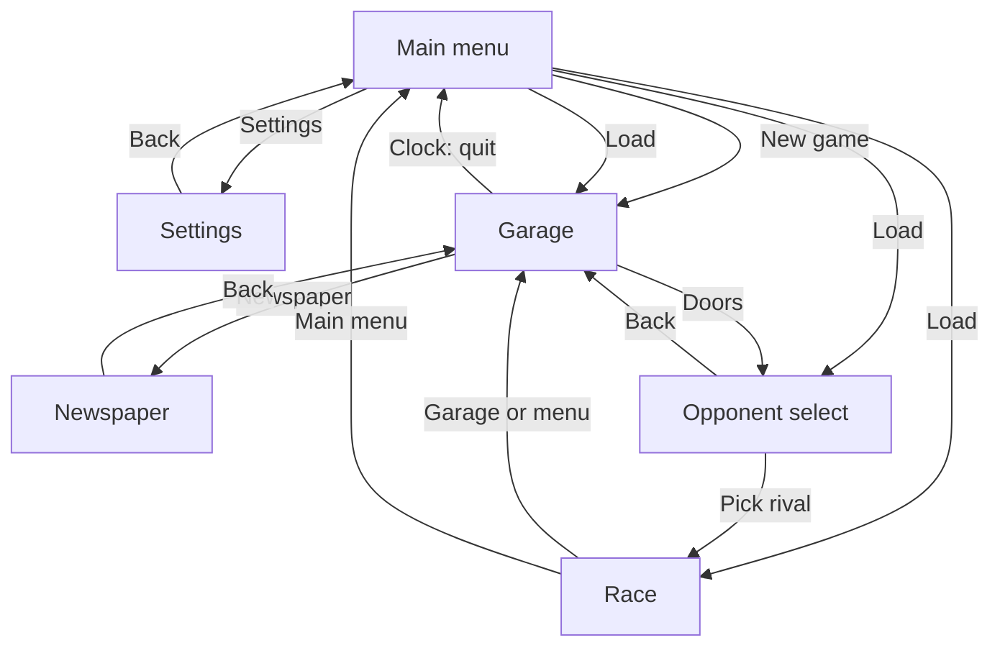
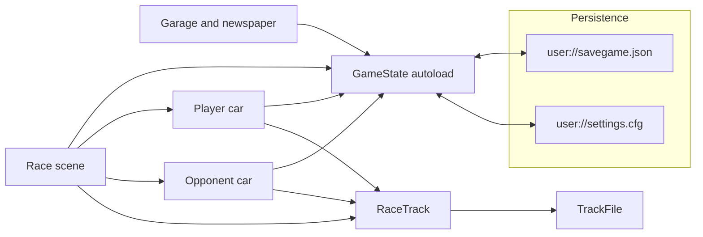
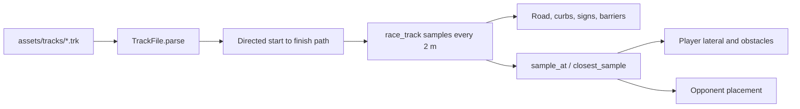

# Architecture

ChrisRod is a single-player Godot 4.6 game. The player builds a car in a garage, buys parts from a newspaper, then races one opponent on either a straight drag strip or a road course loaded from a `.trk` file.

There is no server, database, or external API. All state lives in the `GameState` autoload and is written to the local `user://` directory.

## Scene flow

`project.godot` starts at `res://scenes/main_menu.tscn`. Scenes swap with `SceneTree.change_scene_to_file`. `GameState` stores the last gameplay scene so Load can return there.



| Scene | Script | Role |
| --- | --- | --- |
| `scenes/main_menu.tscn` | `scripts/main_menu.gd` | New game, save, load, settings, quit |
| `scenes/settings.tscn` | `scripts/settings.gd` | Fullscreen, master volume, music toggle |
| `scenes/garage.tscn` | `scripts/garage.gd` | Orbit camera, clickable props, paint, stats |
| `scenes/newspaper.tscn` | `scripts/newspaper.gd` | Buy parts, gearboxes, and used cars |
| `scenes/opponent_select.tscn` | `scripts/opponent_select.gd` | Drag vs road, then pick a rival |
| `scenes/race.tscn` | `scripts/race.gd` | Countdown, HUD, finish, results |
| `scenes/car_vehicle_visual.tscn` | `scripts/car_vehicle_visual.gd` | Shared body and wheel visuals, instanced by garage and both race cars |

## Modules



### Game state

`scripts/game_state.gd` is the only autoload (`GameState`). It owns:

- Economy and garage: cash, owned cars, parts, gearboxes, equipped gearbox, paint color.
- Catalogs: `USED_CARS`, `PARTS`, `GEARBOXES`, `OPPONENTS` (static dictionaries, not resources).
- Race selection: `selected_race_type` (`drag` or `road`) and `selected_opponent_id`.
- Derived stats: `refresh_car_stats()` rebuilds base vmax and horsepower from the current car plus owned parts. `get_effective_vmax_kmh()` then scales by the equipped gearbox `top_speed`.
- Music: one `AudioStreamPlayer` on the autoload. Race uses `assets/music/race.mp3`; every other scene uses `assets/music/garage.mp3`.
- Save and settings (see [setup.md](setup.md)).

Scenes talk to each other only through `GameState` and scene changes. Race scripts duck-type neighbors with `has_method` (`is_race_started`, `get_race_track`, `sample_at`, `closest_sample`).

### Garage

`garage.gd` raycasts from the orbit camera. Colliders carry a `garage_interact` meta tag:

| Tag | Result |
| --- | --- |
| `clock` | Save, load, or return to the main menu |
| `chart` | Stats overlay |
| `newspaper` | Open the classifieds |
| `radio` | Toggle music |
| `doors` | Open opponent select |
| `spray` | Color picker; writes `GameState.car_color` |
| `calendar` | Pulls the wall calendar toward the camera |

The calendar page is built at runtime from the system date (`Label3D` grid).

### Race

`race.gd` runs a three-phase start light (red, red+orange, green). Cars stay stopped until green. The HUD shows speed, gear, distance, time, and opponent name. `rpm_meter.gd` draws the tachometer. `race_touch_controls.gd` shows a wheel, pedals, and shift paddles on mobile, web-mobile, or viewports 900 px wide or narrower.

Two layouts share `scenes/race.tscn`:

- **Drag** (`GameState.RACE_DRAG`): a straight quarter mile (402.336 m) along `+Z`. `track_visuals.gd` builds curbs and a checkered gantry. The ground plane stays active. Finish is an `Area3D`.
- **Road** (`GameState.RACE_ROAD`): `race_track.gd` hides the strip, loads `res://assets/tracks/track1.trk`, and builds the road mesh. The finish area is moved to the path end. Progress also ends the race when remaining distance is about 1 m, because the opponent is placed on the path rather than driven into the trigger.

A win is crossing the finish before the opponent. Holding a manual gearbox past critical RPM for 0.55 s blows the engine and ends the race.

### Cars

Both cars are `CharacterBody3D` nodes with `MOTION_MODE_FLOATING` and a child instance of `car_vehicle_visual.tscn`.

`player_race_car.gd` is an arcade model, not a wheel collider:

- Throttle, brake, and coast change `forward_speed`.
- Gear ratios from the equipped gearbox set each gear’s top speed and acceleration. Horsepower scales acceleration against a 280 hp reference.
- Steering uses a bicycle model (`tan(steer) / wheelbase`). Lock tightens with speed.
- Heading 0 points along world `+Z`.
- Leaving the pavement cuts acceleration and caps speed. Hitting a narrow-obstacle barrier zeros speed.
- Manual boxes shift with Q/E (or touch paddles). Automatic boxes shift themselves. Over-rev is manual only.
- `engine_sound.gd` fills an `AudioStreamGenerator` from RPM and throttle.
- C cycles four cameras: far, close, cockpit, bumper.

`opponent_race_car.gd` uses the same gear idea with a fixed 3-speed ratio set. Stats are the player’s effective vmax and 24 m/s² launch, scaled by the chosen `OPPONENTS` entry. On a road course it advances a path distance and is placed with `sample_at`. On the drag strip it drives straight on `+Z`.

### Track pipeline

`.trk` files are plain JSON, not Godot imports. Format details are in [track-format.md](track-format.md).



`TrackFile` (`class_name`, `RefCounted`) validates the graph and walks directed roads from the start node to the first finish node. `race_track.gd` fillets corners, bakes samples (position, yaw, width, surface, road type), and builds meshes plus narrow-road signs from `assets/signs/`. Surfaces (`wet`, `icy`, and so on) are stored on samples and do not change grip yet.

## File structure

```
ChrisRod/
  project.godot          # name, main scene, autoload, 1280×720
  export_presets.cfg     # Web preset; includes *.trk and *.obj
  scenes/                # one .tscn per screen, plus shared car visual
  scripts/               # one script per scene or subsystem
  assets/
    cars/                # body GLBs
    parts/               # wheel GLB
    music/               # garage.mp3, race.mp3
    signs/               # narrow-road mesh and textures
    tracks/              # track1.trk
  docs/                  # this documentation and track-format.md
  .github/workflows/     # headless Web export and GitHub Pages deploy
```

`assets/vette-c1.stl` and `assets/wheel-c1.stl` remain in the tree. Runtime loading in `stl_mesh_instance.gd` currently points at GLB paths under `assets/cars/` and `assets/parts/`.
